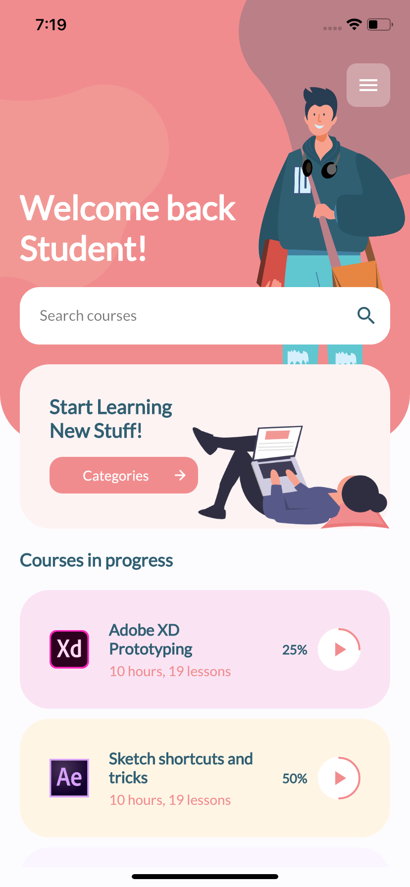
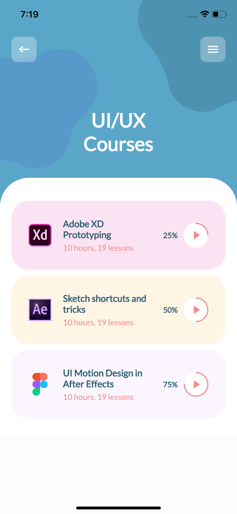

# E-Learning Online Courses App

Application design is based on [Learning Online Courses Mobile App #1](https://dribbble.com/shots/10035849-Learning-Online-Courses-Mobile-App-1) 
designed by [Mikołaj Gałęziowski](https://dribbble.com/galeziowski)

## Screenshots

| Home Page | Categories Page  |
| --- | --- |
| ||

## Getting Started

This project is a starting point for a Flutter application.

A few resources to get you started if this is your first Flutter project:

- [Lab: Write your first Flutter app](https://flutter.dev/docs/get-started/codelab)
- [Cookbook: Useful Flutter samples](https://flutter.dev/docs/cookbook)

For help getting started with Flutter, view our
[online documentation](https://flutter.dev/docs), which offers tutorials,
samples, guidance on mobile development, and a full API reference.
